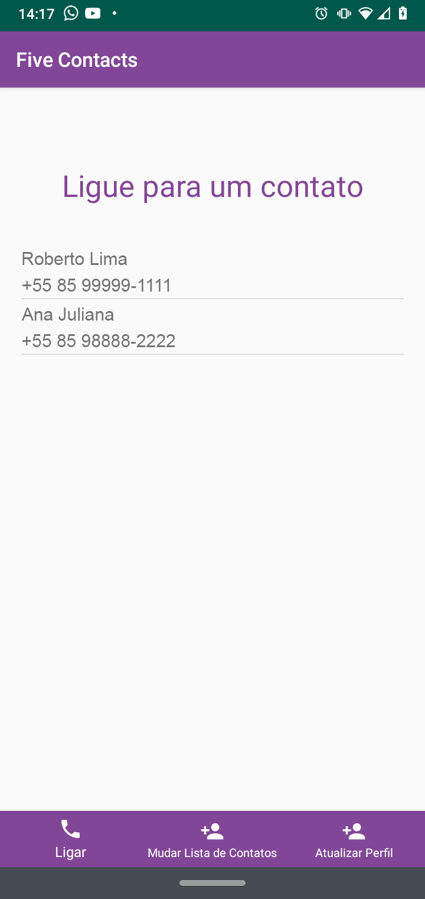
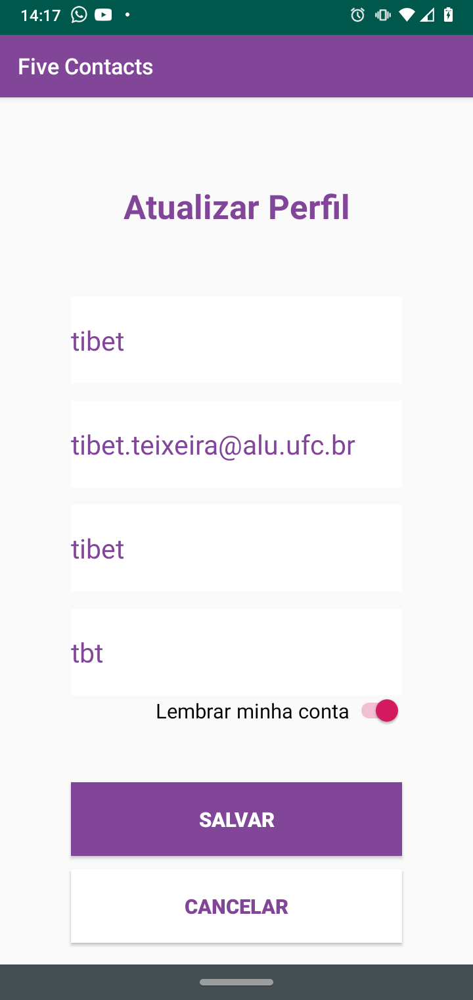

# Five Contacts
Five Contacts app developed on Android

## Purpose
This application is basically to save a contact list for quick dialing

## Demonstration

<kbd>
 
</kbd>
<kbd>

</kbd>
<kbd>
 
</kbd>
<kbd>

</kbd>
<kbd>

</kbd>
<kbd>

</kbd>
<kbd>
 
</kbd>
<kbd>

</kbd>
<kbd>

</kbd>
